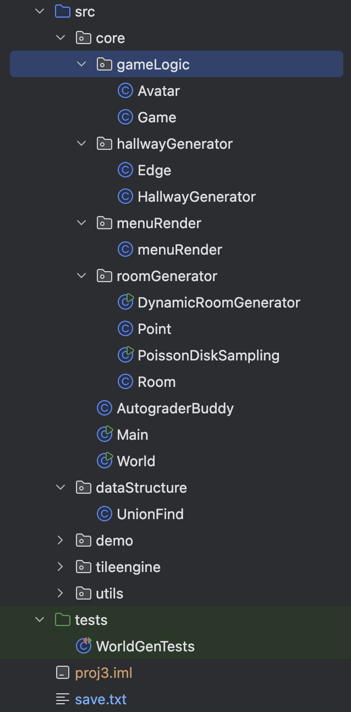

# Build Your Own World -- design doc

## 1. 项目概览

BYOW（创建自己的世界）：要求生成一个2D世界，包括随机的房间，以及用于连接的走廊

**游戏内容**：在主界面选择模式

- 键盘输入 `n or N` 新建游戏
    - 输入数字种子，由数子种子生成新世界（伪随机），每次输入相同的种子会生成相同的世界

- 键盘输入 `l or L` 加载游戏
    - 加载最近一次保存的游戏进度

- 键盘输入 `q or Q` 退出游戏

**进入游戏后**，新建的游戏左下角将出现一个`avatar`，玩家可以通过`w a s d`分别进行上、左、下、右的移动。游戏界面的右上角将出现一个`door` ，由花朵表示。玩家需要将`avatar`移动到`door`处进入下一个关卡.

**在游戏过程中**，玩家可以随时按下`:q or :Q` 来终止并保存游戏，如果直接关闭游戏窗口，游戏则不会保存。

## 2. 构建原理

### 1. 文件结构

#### `core`

包含了核心代码

- `Main.java` 用于启动游戏。

- `gameLogic` 包含了游戏的逻辑，包括游戏运行的循环，以及加载保存的游戏的逻辑
- `roomGenerator` 用于生成随机不重叠的房间（伪随机）
- `hallwayGenerator` 用于生成房间之间的走廊
- `menuGenerator` 用于绘制游戏的开始菜单
- `World.java` 我们构建的世界，包括房间，长廊，游戏角色以及相应的绘制逻辑
- `AutograerBody.java` CS61B提供的可选的用于进行测试的类 （在这里作者并没有实现）

#### `dataStructure`

包含了需要用到的自己实现的数据结构

- `UnionFind.java` 并查集（来自lab05的作者实现），用于支持最小生成树

#### `demo tileengine utils`

课程提供的辅助代码，包括网格外观以及渲染器，和一些代码片段

#### `test`

课程提供的用于测试随机世界的代码（在这里作者没有补充完整）

#### `save.txt`

用于保存游戏进度，一共两行。第一行为游戏最初的种子，第二行为所有的按键输入

### 2. 实现逻辑

#### 1. 生成随机房间

**思路，策略选择，大体代码由ChatGPT辅助决策**

1. 这里采用了蓝噪声取样算法在二维数组里选取一定数目的离散的点，并保证他们有一定的距离
2. 然后以所得到的这些点作为房间的左下角，逐渐膨胀房间的长和宽，在膨胀过程中需要进行合理性检验，即保证房间之间不重叠
3. 最后在`World.java` 绘制即可

#### 2. 生成联通房间的长廊

**思路，策略选择，大体代码由ChatGPT辅助决策**

1.  首先得到各个房间的锚点：以房间的中心坐标作为锚点
2.  然后利用 **链表** 储存各个点以及它们之间的距离，并排序
3.  利用并查集`UnionFind` 实现Kruskal算法得到最小生成树MST

#### 3. 绘制长廊

1. 先找到左边的房间锚点，从左边房间的锚点开始画竖直的长廊
2. 然后从右边锚点开始向左画水平的长廊
3. 然后处理一些长廊之间交错的逻辑，比如如果要绘制的区域已经出现了长廊，则长廊的侧部的墙壁不能再绘制， 主要解决了长廊交错导致先前绘制的长廊被隔断的现象

#### 4.  Main方法逻辑

1. `Main.java` 中先绘制主界面，然后构建输入循环，使得程序对不同的按键输入进行响应
2. 如果按下n，则根据用户输入使用**StringBuilder**来构建种子字符串直到用户按下s
3. 如果按下l，在所保存的文件不为空的情况下，设置`loadMode`为`true`，否则提示还没有进行保存
4. 按下q，则退出程序
5. 如果用户输入有效，则进行相应的游戏界面渲染，并启动`runGame()`

#### 5. 游戏运行`runGame()`

1. 最外层while循环保证游戏一直运行，除非用户进行了保存操作或者强制关闭窗口
2. 根据`loadMode` 是否开启决定初始化世界状态，如果开启则为加载的世界（执行`loadGame()`），如果关闭则为用户输入种子新世界
3. 之后while循环处理键盘输入，并使用**StringBuilder**记录所有的键盘输入（包括一开始的种子）。
4. `moveAvatar()` 方法根据键盘输入移动avatar，并根据游戏规则更新`gameOver` 变量的值，即如果avatat到达门处，设置`gameOver`为`false`，接着根据伪随机对象生成新的种子并重新渲染相应的世界
5. 如果遇到键盘输入`:q or :Q` ，则根据游戏是否初始由加载而来进行**StringBuilder**的保存，如果是由加载而来，则将内容追加到相应文件，否则则直接覆盖原文件内容。保存后直接退出程序

#### 6. 游戏加载 `loadGame()`

1. 获取最初的种子
2. 根据最初的种子构建世界，然后根据`save.txt`中的字符模拟键盘输入
3. 以同样的逻辑设置`gameOver`, 并维护`loadOver`，如果已经加载完所有按键则设置`loadOver`为true，并返回加载好的世界
4. 在`runGame()`中继续进行接下来的游戏逻辑

## 3. 更多

​	作者在这里只是实现了demo，想要真正变为有趣的游戏还需要加入新特性，作者可能将在未来对demo进行更新，读者也可以自行进行更新创作，敬请期待...

